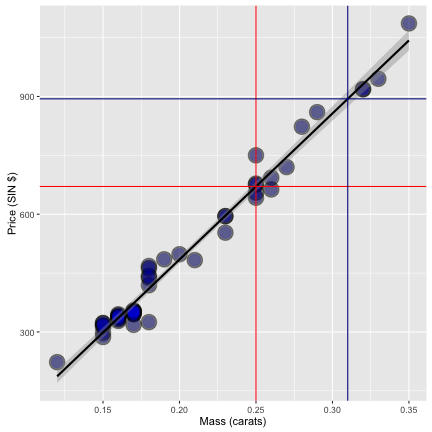

## About the Shiny Application

* The project analyzes the diamond data set from the 'UsingR' package
* The data is diamond prices (in Singapore dollars) and diamond weight in carats (standard measure of diamond mass, 0.2 grams). Below is the output of library(UsingR); data(diamond)

```
##   carat price
## 1  0.17   355
## 2  0.16   328
## 3  0.17   350
## 4  0.18   325
## 5  0.25   642
## 6  0.16   342
```
* The GOAL includes predicting the price of a diamond for the given carat input. Diamond carat weight is the measurement of how much a diamond weighs. A metric "carat" is defined as 200 milligrams.

NOTE - The application may take few seconds to load completely, please wait...

--- .class #id 

## How to use the Application
* Go to https://sanjeevmaheve.shinyapps.io/ddp-project-diamond-price-prediction/ (The applicaton is hosted on the shinyapps.io server)
* The sidebar panel contains slider weiget to choose carat value with step size 0.05
* OR you can also choose any desired carat value by typing into text/drop-down box
* There is an option to enable/disable ggplot which shows/hides "Plot of the diamond data with mass by carats"
* Once the choice is made, the plot shows prediction value derived using linear regression


```r
# Lets estimate an expected dollar value increase in price for every carat 
# increase in mass of diamond.
fit <- lm(price ~ carat, data = diamond)
computePrice <- function(desiredCaretVal) {
  (coef(fit)[1] + coef(fit)[2] * desiredCaretVal)
}
```

--- .class #id 

## Example Output
* Red and darkblue intersections show the linear regression based prediction output for carat value = 0.25 and 0.31 respectively


